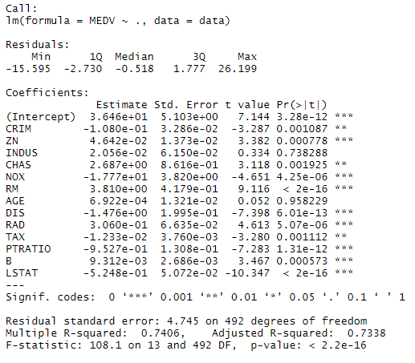
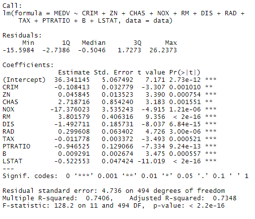
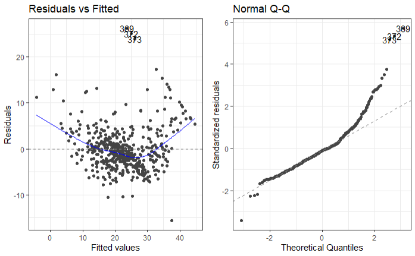
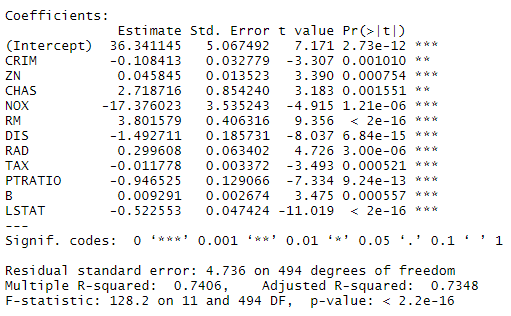
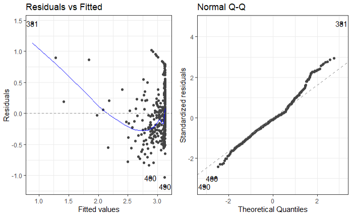
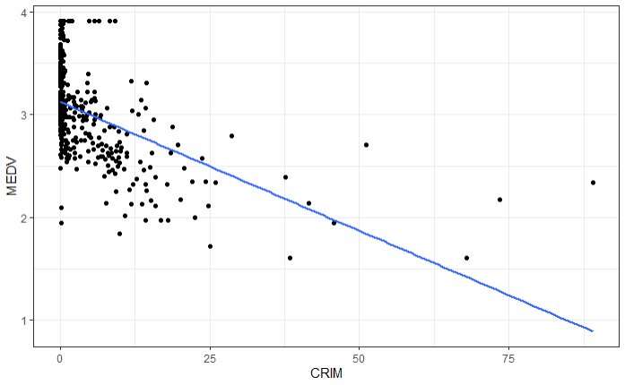

background-image: url(power_point.jpg)
background-size: 100% 100%
.pull-middle[
# .center[`r kableExtra::text_spec("Data Description", color = "white")`]

`r kableExtra::text_spec("This dataset contains information collected by the U.S Census Service concerning housing in the area of Boston Mass", color = "white")`

`r kableExtra::text_spec("Contains 506 cases and was originally published in 1978.", color = "white")`

`r kableExtra::text_spec("The aim of our report is to determine which factors significantly affect the housing prices.", color = "white")`

`r kableExtra::text_spec("In this report, we consider two factors ,which is the full-value property-tax rate per $10,000 and weighted distances to five Boston employment centres", color = "white")`
]

---
background-image: url(power_point.jpg)
background-size: 100% 100%

# .center[`r kableExtra::text_spec("Data Variables", color = "white")`]
This dataset has 14 variables; 

.pull-left[

1) CRIM: the per capita crime rate by town. 

2) ZN: the proportion of residential land zoned for lots over 25,000 sq.ft. 

3) INDUS: the proportion of non-retail business acres  per town 

4) CHAS: Charles River dummy variable( 1 if tract bounds river; 0 otherwise) 

5) NOX: Nitric oxides concentration (PP10M) 

6) RM: Average number of rooms per dwelling 

7) AGE: Proportion of owner-occupied units built prior to 1940 

]

.pull-right[

8) DIS: Weighted distances to five Boston employment centres 

9) RAD: Index of accessibility of radial highways 

10) TAX: Full value property tax rate per $10,000 

11) PTRATIO: Pupil- teacher ratio by town 

12) B: 1000(Bk - 0.63)^2 where Bk is the proportion of blacks by town 

13) LSTAT: % lower status of the population 

14) MEDV: Medium value of owner-occupied homes in $1000's 
]

---
background-image: url(power_point.jpg)
background-size: 100% 100%
# .center[`r kableExtra::text_spec("What did we investigate?", color = "white")`]

---
background-image: url(template2.png)
background-size: 100% 100%
`r kableExtra::text_spec("Do variables in the data set affect the Medium value of owner-occupied homes (in $1000s)?", color = "white", font_size = 24, bold = TRUE)`

.pull-left[
1.We perform mutliple regression with a full model
]

.pull-right[]

---
background-image: url(template2.png)
background-size: 100% 100%
`r kableExtra::text_spec("Do variables in the data set affect the Medium value of owner-occupied homes (in $1000s)?", color = "white", font_size = 24, bold = TRUE)`

.pull-left[
 2.To drop insignificant variables, we use the AIC starting from the full model
.right[]
]

.pull-right[
 3.Write down the fitted model selected in the step-wise procedure

$\widehat{MEDV} = 36.341 - 0.108\times\text{CRIM} + 0.045\times\text{ZN}$

$+ 2.718\times\text{CHAS} - 17.376\times\text{NOX} + 3.801\times\text{RM}$

$- 1.492\times\text{DIS} - 0.0118\times\text{TAX} - 0.012\times\text{PTRATIO}$

$+ 0.009\times\text{B} -  0.522\times\text{LSTAT}$
]

---
background-image: url(template2_empty.png)
background-size: 100% 100%
.pull-left[
 4.We check our linear model assumptions

.right[]
 - Linearity
 - Homoskedasticity
 - Normality
]

.pull-right[
 5.What proportion of the variability of MEDV is explained by the explanatory variables in the step-wise selected model?

.right[]

 Looking at the R2 value (multiple R-squared) from the summary output, ~74% of the variability is explained by the regression on the variables
]

---
background-image: url(template.png)
background-size: 100% 100%
# .center[`r kableExtra::text_spec("Inference", color = "white")`]

.center[`r kableExtra::text_spec("Testing for the significance of the slope parameter β1", color = "white")`]

---
background-image: url(template_empty.png)
background-size: 100% 100%
 Weighted distances to five Boston employment centres vs House pricing
.pull-left[
.right[]
 - Linearity
 - Homoskedasticity
 - Normality
]

.pull-right[
.right[]
Inference: 
 $H_0\colon\ \beta_1 = 0$ vs $H_1\colon\ \beta_1 \neq 0$
 $t_0 = \dfrac{1.0916}{0.1884} = 5.79$
 $2P(t_{504 }\ge 5.79) < 0.0001 (1.206612e-08)$
]

---
background-image: url(template_empty.png)
background-size: 100% 100%
 The per capita crime rate by town vs House Pricing

.pull-left[
.right[]

 - Linearity
 - Homoskedasticity
 - Normality
]

.pull-right[
.right[]
Inference:
 $H_0\colon\ \beta_1 = 0$ vs $H_1\colon\ \beta_1 \neq 0$
 $t_0 = \dfrac{-0.41519}{0.043890} = -9.4597$
 $2P(t_{109}\ge -9.4597) < 0.0001 (1.173987e-19)$

]

---
background-image: url(template.png)
background-size: 100% 100%
# .center[`r kableExtra::text_spec("Conclusion", color = "white")`]

